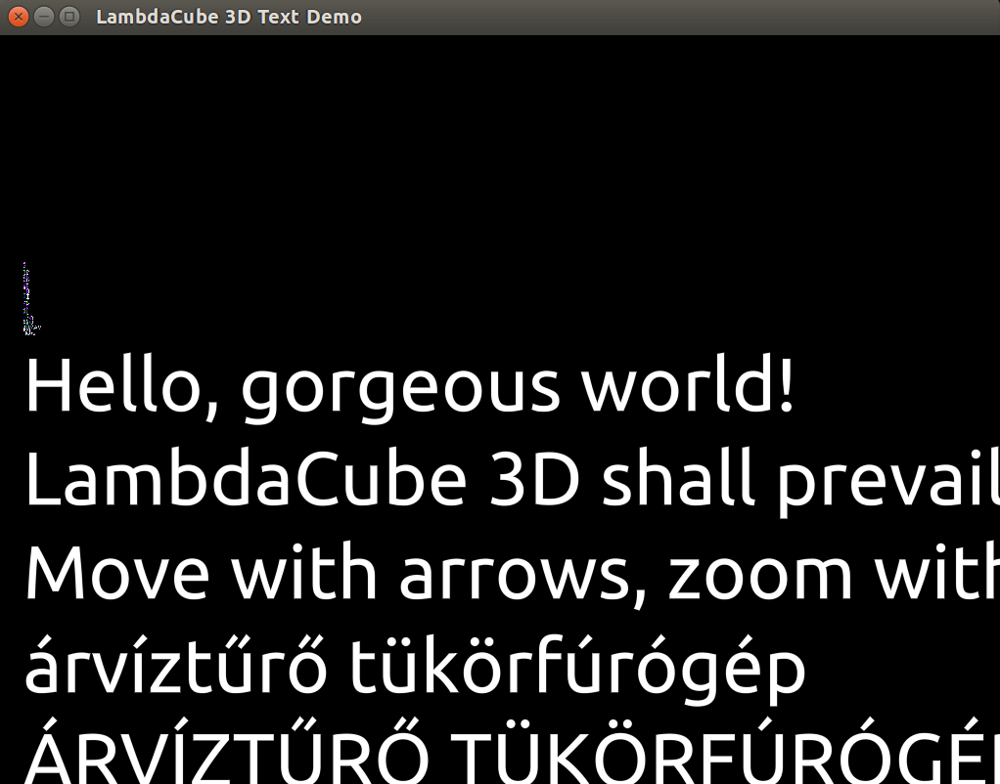

# LambdaCube Font Engine

This is a work-in-progress project to provide font rendering capabilities for [LambdaCube 3D](https://github.com/lambdacube3d/lambdacube-edsl).

The basic idea behind the composite distance field approximation method is described in a [blog post](http://lambdacube3d.wordpress.com/2014/11/12/playing-around-with-font-rendering/).

#### On **Linux** install the following libraries.
   i.e. on Ubuntu:
   ```
   sudo apt install libgl1-mesa-dev libxi-dev libxcursor-dev libxinerama-dev libxrandr-dev zlib1g-dev libpulse-dev
   ```
   For other Linux distributions make sure the corresponing packages are installed.

   *These libraries required for OpenGL development.*


## Compile & Run:

To compile you will need [Haskell Stack](https://docs.haskellstack.org/en/stable/README/).

```
stack setup
stack build
stack exec -- lafonten-test Ubuntu-R.ttf
```


